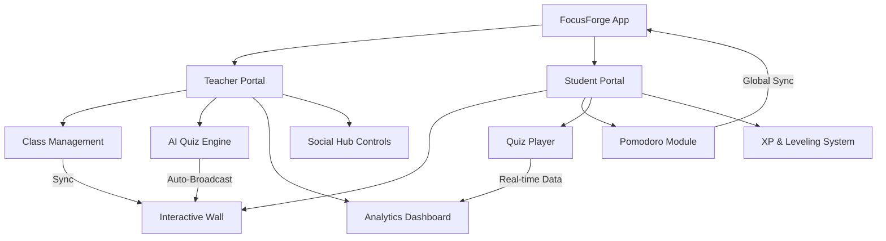

# FocusForge: AI-Driven Productivity & Education Ecosystem

FocusForge is a high-fidelity, dual-portal platform designed to bridge the gap between structured classroom management and personal productivity. Built with **Next.js 15**, **Supabase**, and **Prisma**, it leverages AI to automate assessment while maintaining a vibrant social learning hub.

---

## 🏛️ System Architecture Overview

### **Core Technology Stack**
- **Frontend**: Next.js 15 (App Router), Tailwind CSS v4, Framer Motion (Micro-animations).
- **Backend**: Server Actions, Prisma ORM.
- **Database**: Supabase (PostgreSQL + Auth + Realtime).
- **AI Engine**: OpenAI GPT-4o-mini (Quiz Generation).
- **Real-time**: Supabase Realtime for Wall updates and Notifications.

---

## 👨‍🏫 Teacher Portal: Command & Control

The Teacher Portal is designed for maximum efficiency, allowing educators to manage large classes with automated tools.

### **1. Classroom Management**
- **Dynamic Roster**: Real-time student tracking, banning/removing capabilities, and XP monitoring.
- **Join Codes**: NanoID-generated unique codes for secure student enrollment.
- **Activity Sidebar**: Quick-access tools for creating Tasks, Quizzes, and Document sharing.

### **2. AI Quiz Engine (Master Module)**
- **Strict Generation**: Request exact question counts (e.g., 20 questions) with specific difficulty/topics.
- **Auto-Broadcasting**: Quizzes are instantly "broadcast" to the Classroom Wall as interactive cards.
- **XP Calibration**: Automatic scaling of XP rewards based on question volume (25 XP per question).

### **3. Analytics Dashboard**
- **Student Standings**: Live leaderboard of quiz submissions.
- **Accuracy Filtering**: Automatically filters out "Teacher Tests" to keep class averages accurate.
- **Raw Metrics**: Average score, participant volume, and XP distribution charts.

---

## 🎓 Student Portal: Interactive Learning

The Student Portal focuses on engagement, gamification, and productivity.

### **1. The Social Hub (Wall)**
- **Rich Activity Cards**: Specialized UI for Quizzes, Tasks, and Documents.
- **Social Interaction**: Threaded comments and emoji reactions on all class updates.
- **Direct Launching**: Launch AI Quizzes or view resources directly from the feed.

### **2. Pomodoro Productivity Module**
- **Integrated Task List**: Live sync of upcoming Assignments and AI Quizzes directly next to the timer.
- **Focus Enforcement**: "Strict Mode" that detects browser-level distractions.
- **Audio Notifications**: High-fidelity alarm tones (Bell) upon session completion.
- **XP Forging**: Earn 2 XP per minute of focus, synchronized with global levels.

### **3. Quiz Player**
- **Immersive Mode**: Clean, distraction-free UI for assessments.
- **Instant Grading**: Real-time score calculation and XP rewarding.
- **Performance Feedback**: Detailed explanations for correct/incorrect answers provided by AI.

---

## 🔄 Step-by-Step Classroom Workflow

1. **Initialization**: Teacher creates a class and shares the **Join Code**.
2. **Engagement**: Teacher uses the **AI Engine** to generate a topic-specific quiz (e.g., "Advanced Algebra").
3. **Synchronization**: The system creates the Quiz and **auto-posts** a Rich Card to the **Classroom Wall**.
4. **Interaction**: Students see the update on their Wall, leave comments/reactions, and click **"Launch Quiz"**.
5. **Validation**: Student completes the quiz, earns XP, and their results are instantly synced to the Teacher's **Analytics Dashboard**.
6. **Review**: Teacher clicks **"Review Results"** directly on the Wall post to monitor class comprehension.

---

## 📈 Current Progress & Feature Map

| Feature Area | Status | Capability |
| :--- | :---: | :--- |
| **Authentication** | ✅ | Role-based (Teacher/Student) via Supabase Auth |
| **AI Quiz Engine** | ✅ | Strict count enforcement, Auto-Wall posting |
| **Social Hub** | ✅ | Threaded comments, Reactions, Polymorphic cards |
| **Pomodoro Timer** | ✅ | Audio Alarms, Task Sidebar Sync, Strict Mode |
| **Analytics** | ✅ | Teacher-filtered metrics, Participant tracking |
| **XP System** | ✅ | Unlimited ceiling, Level calculation, Multi-source earning |
| **Real-time Sync** | ⏳ | Supabase Realtime integration for live notifications |

---

## 🚀 Next Phases
- **Notification Inbox**: Global alert system for new posts and mentions.
- **Export System**: Capability for teachers to download CSV analytics.
- **Dark Mode Optimization**: Finalizing the HSL-tailored dark theme tokens.

> [!TIP]
> **Pro-Tip for Teachers**: Use the "Pomodoro" link in your sidebar to stay focused while grading or planning—it's now a complete module for both portals!
